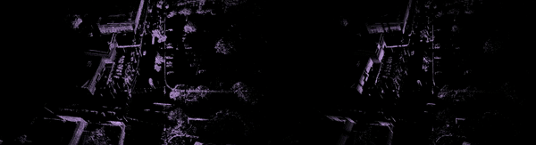

## [Neural Scene Flow Prior](https://papers.nips.cc/paper/2021/file/41263b9a46f6f8f22668476661614478-Paper.pdf)
[](https://opensource.org/licenses/MIT)

[Xueqian Li](https://lilac-lee.github.io/), [Jhony Kaesemodel Pontes](https://jhonykaesemodel.com/), 
[Simon Lucey](https://www.adelaide.edu.au/directory/simon.lucey)

Will appear on Thirty-fifth Conference on Neural Information Processing Systems (**NeurIPS, 2021**) as **spotlight**.

arXiv link: https://arxiv.org/pdf/2111.01253.pdf


- #### Scene flow results on Argoverse
    

- #### Point cloud integration (left: densified point cloud; right: sparse point cloud)
    


### Prerequisites
This code is based on PyTorch implementation, and tested on torch=1.6.0 with CUDA 10.1 **OR** torch=1.7.1 with CUDA 10.2. 

For a detailed installation guide, please go to [requirements.txt](requirements.txt).


### Dataset
We provide four datasets we used in our paper.
You may download datasets used in the paper from these anonymous links:

- [KITTI](https://drive.google.com/file/d/1pjShY0RxHp0EjkelWGLO_BMR7qCB528p/view?usp=sharing) (266MB)

- [Argoverse](https://drive.google.com/file/d/1qyTaLz1_CTF3IB1gr3XpIiIDh6klQOA4/view?usp=sharing) (370MB)

- [nuScenes](https://drive.google.com/file/d/1mCjDqJzaMdW0iiM2N2J5BNvo04dAvTbx/view?usp=sharing) (73MB)

- [FlyingThings3D](https://drive.google.com/file/d/1v9M0sRCHKrPj5phHxC03-WsdhctUL9j9/view?usp=sharing) (948MB)

After you download the dataset, you can create a symbolic link in the ./dataset folder as ```./dataset/kitti```, ```./dataset/argoverse```, ```./dataset/nuscenes```, and ```./dataset/flyingthings```.


### Optimization
Since we use neural scene flow prior for runtime optimization, our method does not include any "training". 

Just run following lines for a simple optimization on a small KITTI Scene Flow dataset (only 50 testing samples)
```
python optimization.py \
--dataset KITTISceneFlowDataset \
--dataset_path dataset/kitti \
--exp_name KITTI_2048_points \
--batch_size 1 \
--iters 5000 \
--compute_metrics \
--num_points 2048 \
--hidden_units 128 \
--lr 0.008 \
--backward_flow \
--early_patience 70 \
--visualize
```

You can then play with these configurations.
We provide commands we used to generate results in the small point coud (2048 points) experiments and large point cloud (all points included) experiments.

#### 1. small point cloud (2048 points)

#### KITTI Scene Flow
```
python optimization.py \
--dataset KITTISceneFlowDataset \
--dataset_path dataset/kitti \
--exp_name KITTI_2048_points \
--batch_size 1 \
--iters 5000 \
--compute_metrics \
--num_points 2048 \
--hidden_units 128 \
--lr 0.008 \
--backward_flow \
--early_patience 70 \
--visualize
```

#### Argoverse Scene Flow
```
python optimization.py \
--dataset ArgoverseSceneFlowDataset \
--dataset_path dataset/argoverse \
--exp_name Argoverse_2048_points \
--batch_size 1 \
--iters 5000 \
--compute_metrics \
--num_points 2048 \
--hidden_units 128 \
--lr 0.008 \
--backward_flow \
--early_patience 30 \
--visualize
```

#### nuScenes Scene Flow
```
python optimization.py \
--dataset NuScenesSceneFlowDataset \
--dataset_path dataset/nuscenes \
--exp_name Argoverse_2048_points \
--batch_size 1 \
--iters 5000 \
--compute_metrics \
--num_points 2048 \
--hidden_units 128 \
--lr 0.008 \
--backward_flow \
--early_patience 30 \
--visualize
```

#### FlyingThings3D
```
python optimization.py \
--dataset FlyingThings3D \
--dataset_path dataset/flyingthings \
--exp_name FlyingThings_2048_points \
--batch_size 1 \
--iters 5000 \
--compute_metrics \
--num_points 2048 \
--hidden_units 128 \
--lr 0.008 \
--backward_flow \
--early_patience 30 \
--visualize
```

#### 2. dense point cloud (all points included)

#### KITTI Scene Flow
```
python optimization.py \
--dataset KITTISceneFlowDataset \
--dataset_path dataset/kitti \
--exp_name KITTI_2048_points \
--batch_size 1 \
--iters 5000 \
--compute_metrics \
--use_all_points \
--hidden_units 128 \
--lr 0.001 \
--early_patience 100 \
--visualize
```

#### Argoverse Scene Flow
```
python optimization.py \
--dataset ArgoverseSceneFlowDataset \
--dataset_path dataset/argoverse \
--exp_name Argoverse_2048_points \
--batch_size 1 \
--iters 5000 \
--compute_metrics \
--use_all_points \
--hidden_units 128 \
--lr 0.003 \
--backward_flow \
--early_patience 100 \
--visualize
```


### Contributing
If you find the project useful for your research, you may cite,
```
@inproceedings{li2021neural,
  title={Neural Scene Flow Prior},
  author={Li, Xueqian and Pontes, Jhony Kaesemodel and Lucey, Simon},
  booktitle={Thirty-Fifth Conference on Neural Information Processing Systems},
  year={2021}
}
```